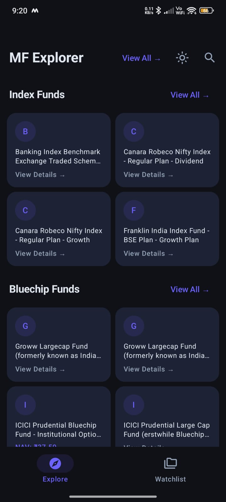
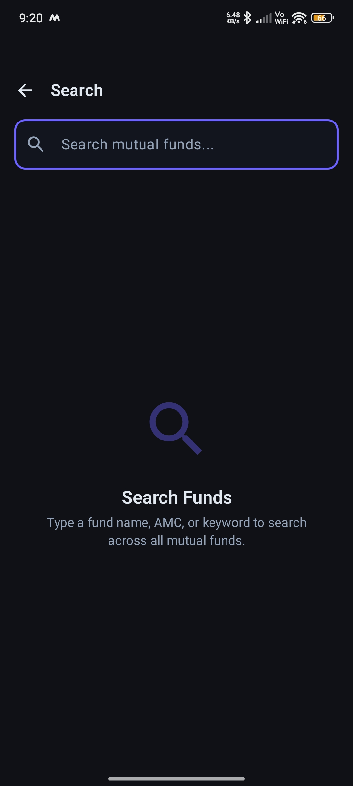
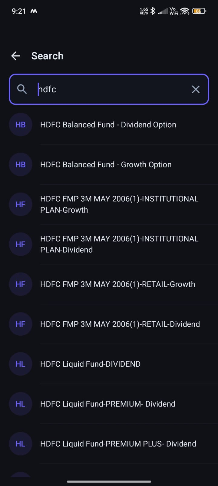
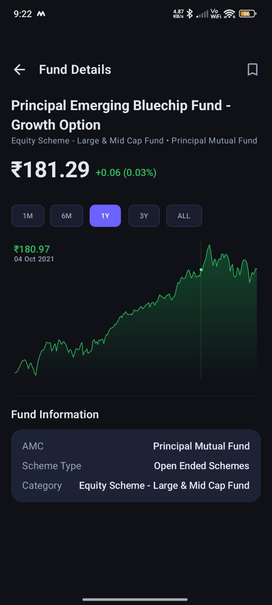
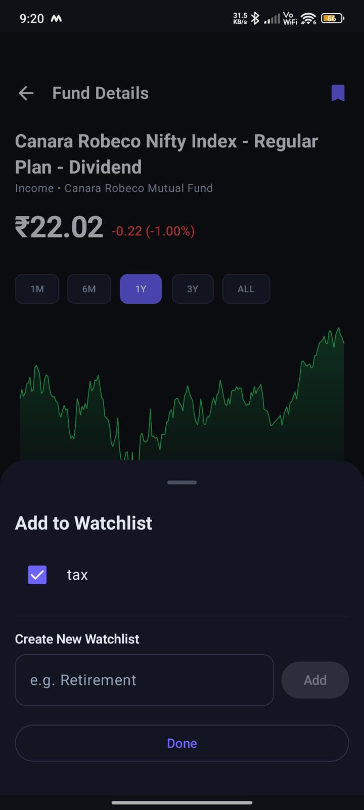
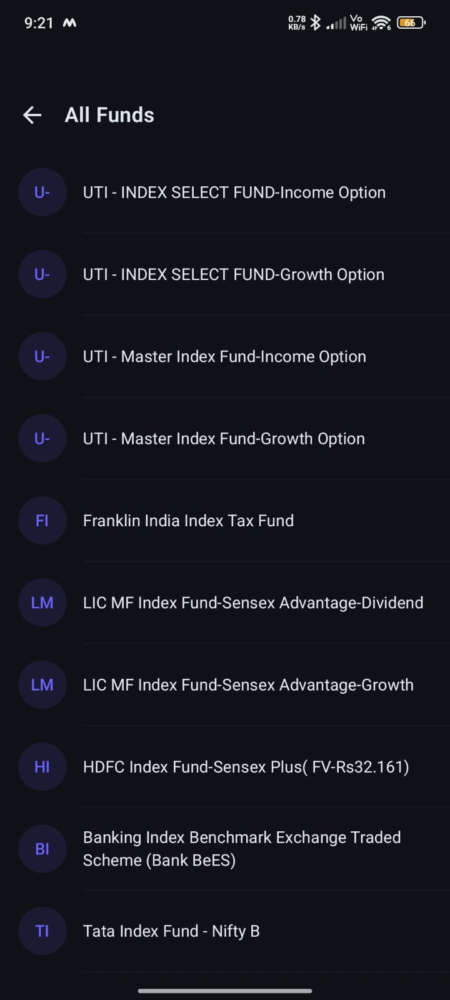
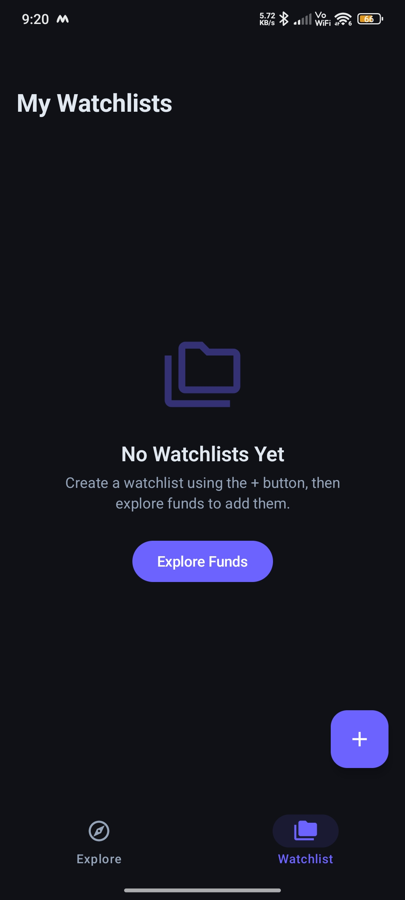
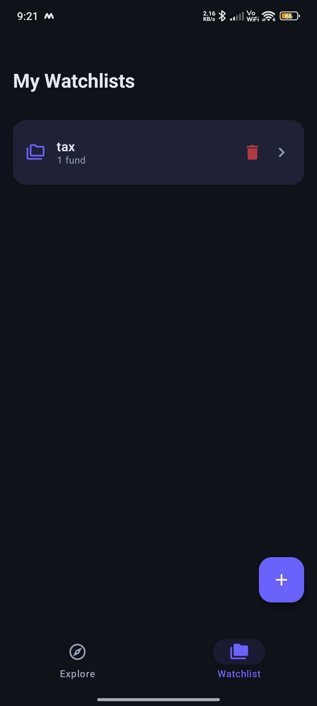
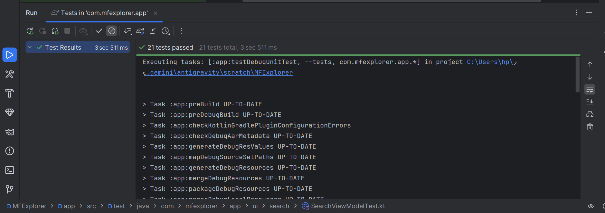

#  MF Explorer

A clean, dark-themed Android app to **explore, search, and track Indian Mutual Funds** — built entirely with Jetpack Compose and powered by the free [mfapi.in](https://www.mfapi.in/) public API.

---

##  Screenshots

| Explore | Search | Search Results |
|--------|--------|----------------|
|  |  |  |

| Fund Detail | Add to Watchlist | All Funds |
|------------|-----------------|-----------|
|  |  |  |

| Watchlist Empty | Watchlist |
|----------------|-----------|
|  |  |

---

##  Features

- **Explore Screen** — Browse curated fund categories like Index Funds and Bluechip Funds with a 2-column card layout and "View All" navigation.
- **Search** — Real-time search across all mutual funds by fund name, AMC, or keyword.
- **Fund Details** — View NAV, daily change, interactive NAV chart (1M / 6M / 1Y / 3Y / ALL), and fund information (AMC, scheme type, category).
- **Watchlists** — Create named watchlists (e.g., "tax", "Retirement"), add funds from the detail screen via a bottom sheet, and manage them from the Watchlist tab.
- **Offline Caching** — Fund data is cached locally via Room so previously viewed funds load instantly.
- **Shimmer Loading** — Smooth shimmer placeholders while data is fetching.
- **Dark Theme** — Full dark-mode UI with Material 3 theming.

---

## 🏗 Architecture

The app follows **MVVM + Repository** pattern with a clean separation of concerns:

```
com.mfexplorer.app
├── data
│   ├── local          # Room DB (CachedFund, Watchlist, WatchlistFund entities & DAOs)
│   ├── remote         # Retrofit API (MfApi, DTOs)
│   └── repository     # FundRepository, WatchlistRepository
├── di                 # Hilt modules (AppModule, NetworkModule)
├── domain
│   └── model          # Domain models (MutualFund, FundDetail, FundCategory, Watchlist, NavEntry)
└── ui
    ├── components     # Shared composables (FundCard, FundListItem, NavChart, ShimmerEffect, EmptyState, ErrorState)
    ├── detail         # FundDetailScreen + ViewModel, WatchlistBottomSheet
    ├── explore        # ExploreScreen + ViewModel
    ├── navigation     # NavGraph, Screen (sealed routes)
    ├── search         # SearchScreen + ViewModel
    ├── theme          # Color, Typography, Theme
    ├── viewall        # ViewAllScreen, AllFundsScreen + ViewModels
    └── watchlist      # WatchlistScreen, WatchlistDetailScreen + ViewModels
```

---

##  Tech Stack

| Layer | Library |
|-------|---------|
| UI | Jetpack Compose + Material 3 |
| Navigation | Compose Navigation 2.7.7 |
| State Management | ViewModel + StateFlow |
| Dependency Injection | Hilt 2.51 |
| Networking | Retrofit 2.9.0 + OkHttp 4.12.0 + Gson |
| Local Database | Room 2.6.1 |
| Preferences | DataStore |
| Animations | Lottie Compose 6.3.0 |
| Testing | JUnit 4, MockK, Turbine, Coroutines Test |

---

##  Unit Testing

**21 tests passing** across 3 test classes — covering the repository, ViewModel, and utility layers.

| Test Class | Tests |
|------------|-------|
| `WatchlistRepositoryTest` | CRUD operations, ordering, Flow delegation |
| `SearchViewModelTest` | Initial state, query changes, clear, 300ms debounce |
| `DateUtilsTest` | Date parsing, NAV formatting, change calculation |

<!--  -->

```bash
./gradlew test
```

---

##  API

Uses the free, open-source **[mfapi.in](https://www.mfapi.in/)** API — no API key required.

| Endpoint | Description |
|----------|-------------|
| `GET /mf/search?q={query}` | Search funds by name or keyword |
| `GET /mf/{schemeCode}` | Get full NAV history & fund details |

Base URL: `https://api.mfapi.in/`

---

##  Getting Started

### Prerequisites

- Android Studio Hedgehog or newer
- JDK 17
- Android SDK 26+

### Steps

1. **Clone the repository**
   ```bash
   git clone https://github.com/pratish444/MFExplorer
   cd MFExplorer
   ```

2. **Open in Android Studio**
    - File → Open → select the `MFExplorer` folder

3. **Build & Run**
    - Connect a device or start an emulator (API 26+)
    - Click ▶️ Run

No API keys or environment variables are needed — the app works out of the box.

---

##  Project Setup

| Config | Value |
|--------|-------|
| `minSdk` | 26 (Android 8.0) |
| `targetSdk` | 34 (Android 14) |
| `compileSdk` | 34 |
| `versionName` | 1.0 |
| Kotlin | 1.9.x |
| Compose BOM | 2024.02.00 |
